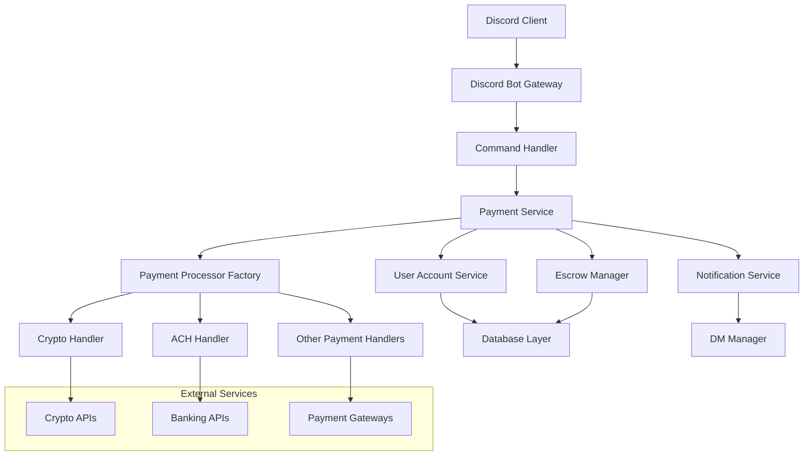

# Design Document

## Overview

The Discord Payment Bot is a comprehensive financial transaction system that operates as a trusted middleman within Discord servers. The bot facilitates secure payments between users through multiple payment methods including cryptocurrency, ACH transfers, and other payment sources. The system uses an escrow-based approach to ensure transaction security and provides private account setup through direct messages.

## Architecture

### High-Level Architecture



### Core Components

1. **Discord Bot Gateway**: Handles Discord API interactions and slash commands
2. **Command Handler**: Routes and validates user commands
3. **Payment Service**: Orchestrates payment flows and business logic
4. **Escrow Manager**: Manages fund holding and release mechanisms
5. **Payment Processor Factory**: Creates appropriate payment handlers based on method
6. **User Account Service**: Manages user payment method configurations
7. **Notification Service**: Handles all user communications via DMs and channels

## Components and Interfaces

### Discord Bot Interface

```typescript
interface DiscordBotService {
  registerSlashCommands(): Promise<void>
  handlePayCommand(interaction: CommandInteraction): Promise<void>
  handleRequestCommand(interaction: CommandInteraction): Promise<void>
  handleTransactionsCommand(interaction: CommandInteraction): Promise<void>
  handleSetupPaymentCommand(interaction: CommandInteraction): Promise<void>
  handlePaymentConfigCommand(interaction: CommandInteraction): Promise<void>
}
```

### Payment Service Interface

```typescript
interface PaymentService {
  initiatePayment(senderId: string, recipientId: string, amount: number, method: PaymentMethod): Promise<Transaction>
  processPaymentRequest(requestId: string, approved: boolean): Promise<void>
  getTransactionHistory(userId: string): Promise<Transaction[]>
  validatePaymentLimits(userId: string, amount: number, serverId: string): Promise<boolean>
}
```

### Escrow Manager Interface

```typescript
interface EscrowManager {
  holdFunds(transactionId: string, amount: number, paymentMethod: PaymentMethod): Promise<EscrowRecord>
  releaseFunds(transactionId: string, recipientMethod: PaymentMethod): Promise<void>
  returnFunds(transactionId: string): Promise<void>
  getEscrowStatus(transactionId: string): Promise<EscrowStatus>
}
```

### Payment Processor Interface

```typescript
interface PaymentProcessor {
  validatePaymentMethod(accountDetails: PaymentMethodDetails): Promise<boolean>
  withdrawFunds(accountDetails: PaymentMethodDetails, amount: number): Promise<WithdrawalResult>
  depositFunds(accountDetails: PaymentMethodDetails, amount: number): Promise<DepositResult>
  getProcessingTime(): Promise<ProcessingTimeEstimate>
  calculateFees(amount: number): Promise<FeeCalculation>
}
```

## Data Models

### User Account Model

```typescript
interface UserAccount {
  discordId: string
  paymentMethods: PaymentMethodConfig[]
  transactionHistory: string[] // Transaction IDs
  notificationPreferences: NotificationSettings
  createdAt: Date
  updatedAt: Date
}

interface PaymentMethodConfig {
  id: string
  type: PaymentMethodType // 'crypto' | 'ach' | 'other'
  displayName: string
  encryptedDetails: string // Tokenized payment details
  isActive: boolean
  addedAt: Date
}
```

### Transaction Model

```typescript
interface Transaction {
  id: string
  senderId: string
  recipientId: string
  amount: number
  currency: string
  senderPaymentMethod: PaymentMethodConfig
  recipientPaymentMethod: PaymentMethodConfig
  status: TransactionStatus
  escrowRecord?: EscrowRecord
  fees: FeeBreakdown
  createdAt: Date
  completedAt?: Date
  failureReason?: string
}

enum TransactionStatus {
  PENDING = 'pending',
  ESCROWED = 'escrowed',
  COMPLETED = 'completed',
  FAILED = 'failed',
  CANCELLED = 'cancelled'
}
```

### Server Configuration Model

```typescript
interface ServerConfig {
  serverId: string
  paymentsEnabled: boolean
  dailyLimits: {
    maxAmountPerUser: number
    maxTransactionsPerUser: number
  }
  allowedPaymentMethods: PaymentMethodType[]
  adminUserIds: string[]
  createdAt: Date
  updatedAt: Date
}
```

### Escrow Record Model

```typescript
interface EscrowRecord {
  transactionId: string
  amount: number
  currency: string
  paymentMethod: PaymentMethodType
  externalTransactionId: string // From payment processor
  status: EscrowStatus
  createdAt: Date
  releaseAt?: Date
}

enum EscrowStatus {
  HOLDING = 'holding',
  RELEASED = 'released',
  RETURNED = 'returned'
}
```

## Error Handling

### Error Categories

1. **Validation Errors**: Invalid commands, insufficient funds, payment method issues
2. **Payment Processor Errors**: External API failures, network timeouts
3. **Escrow Errors**: Fund holding/release failures
4. **Discord API Errors**: Message sending failures, permission issues
5. **Database Errors**: Connection issues, data consistency problems

### Error Handling Strategy

```typescript
interface ErrorHandler {
  handleValidationError(error: ValidationError, context: CommandContext): Promise<void>
  handlePaymentProcessorError(error: PaymentProcessorError, transaction: Transaction): Promise<void>
  handleEscrowError(error: EscrowError, transaction: Transaction): Promise<void>
  handleDiscordAPIError(error: DiscordAPIError, context: CommandContext): Promise<void>
}
```

### Retry and Recovery Mechanisms

- **Payment Processor Failures**: Exponential backoff retry with circuit breaker
- **Escrow Failures**: Manual intervention queue with admin notifications
- **Discord API Failures**: Message queuing with delayed retry
- **Database Failures**: Connection pooling with failover support

## Testing Strategy

### Unit Testing

- **Payment Service**: Mock external payment processors and database
- **Escrow Manager**: Test fund holding and release logic with mock processors
- **Command Handlers**: Mock Discord interactions and validate response formatting
- **Payment Processors**: Test each payment method handler independently

### Integration Testing

- **End-to-End Payment Flow**: Test complete payment cycle with test payment methods
- **Discord Bot Integration**: Test slash command registration and interaction handling
- **Database Integration**: Test data persistence and retrieval operations
- **External API Integration**: Test with sandbox/test environments for payment processors

### Security Testing

- **Input Validation**: Test command parameter sanitization and validation
- **Payment Method Security**: Verify tokenization and encryption of sensitive data
- **Access Control**: Test server admin permissions and user authorization
- **Escrow Security**: Verify fund isolation and proper release mechanisms

### Performance Testing

- **Concurrent Transactions**: Test system behavior under multiple simultaneous payments
- **Database Performance**: Test query performance with large transaction histories
- **Discord Rate Limiting**: Test compliance with Discord API rate limits
- **Payment Processor Limits**: Test handling of external API rate limits

### Test Data Management

- **Mock Payment Methods**: Create test crypto wallets and bank account simulators
- **Test Discord Server**: Set up dedicated test server with various user roles
- **Transaction Scenarios**: Create comprehensive test cases for all payment flows
- **Error Simulation**: Mock various failure scenarios for robust error handling testing